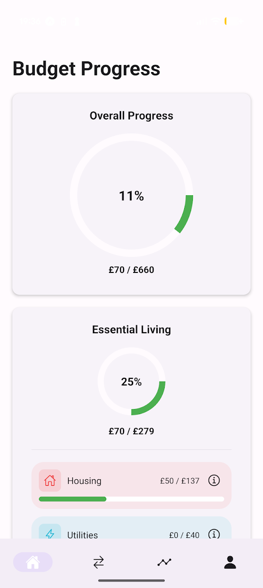
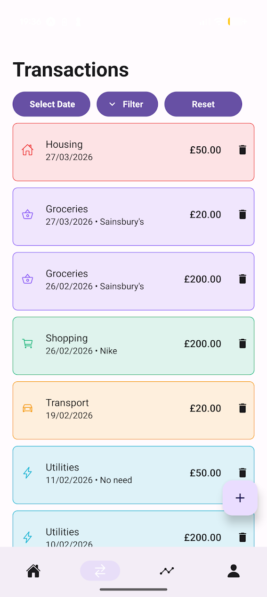
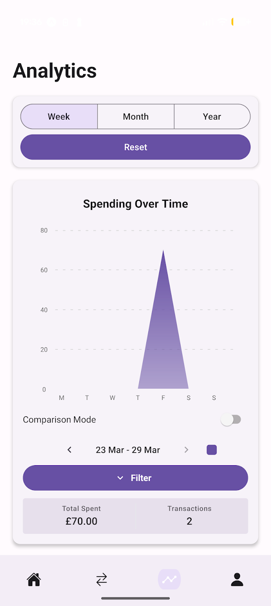

# Savr - Mobile Budgeting Application

This is my dissertation for my Bsc in computer science. This application tackles the issue of decreasing financial literacy amongst adults through recommender systems, AI-generated advice, data visualisations, and monthly feedback reports.

## Preview





## How its made

[](https://reactnative.dev/)
[](https://expo.dev/)
[](https://nodejs.org/)
[](https://expressjs.com/)
[](https://neon.tech/)
[](https://clerk.com/)
[](https://groq.com/)

- React Native is used for the frontend chosen due to its cross platform capabilities and wide spread adoption
- Expo Go was used for simplified development workflow
- Node.js + Express used for backend system chosen due to its reliability and widespread adoption
- NeonDB chosen as the Database due to its relational structure that provides data integrity and native JSONB support for efficient handling of JSON objects.
- Clerk used for authentication and user management
- Groq provides access to Meta's Llama model for AI integration and supplies a generous number of tokens through its free tier.

## Getting started:

### Prerequisites:

- Node.js
- Expo Go app installed on mobile device
- A NeonDB database
- A Clerk account
- A Groq API key

### Environment Variables:

create a .env file in the `savr-backend/api` and `savr-mobile` directory and populate them with the following variables

#### Backend - savr-backend/api/.env

```env
PORT=your_port_number
DATABASE_URL=your_neondb_connection_url
CLERK_PUBLISHABLE_KEY=your_clerk_publishable_key
CLERK_SECRET_KEY=your_clerk_secret_key
GROQ_API_KEY=your_groq_api_key
```

#### Frontend - savr-mobile/.env

```env
EXPO_PUBLIC_CLERK_PUBLISHABLE_KEY=your_clerk_publishable_key
EXPO_PUBLIC_RENDER_URL=your_render_deployment_url
```

### Setup

#### 1. Install NPM packages

```shell
# backend
cd savr-backend/api
npm install
npm audit fix

# frontend
cd savr-mobile
npm install
npm audit fix
```

#### 2. Configure IP

In `savr-mobile/constants/config.ts`, update API_URL to match the IP of your device, its important that the device you run the backend from and the mobile device you use are on the same network.
To find your local IP run ipconfig if on windows or ifconfig on macOS.
If desired the backend can be hosted as a web service and API_URL can reference the env variable `EXPO_PUBLIC_RENDER_URL`

### Running the app

#### Run the backend server

```shell
cd savr-backend/api
npm run dev
```

#### Run the application

```shell
cd savr-mobile
npx expo start
```

A QR code will be generate through Expo for you to scan either using your camera or the Expo Go App. Doing so will lead to the launch of Savr on your device.
